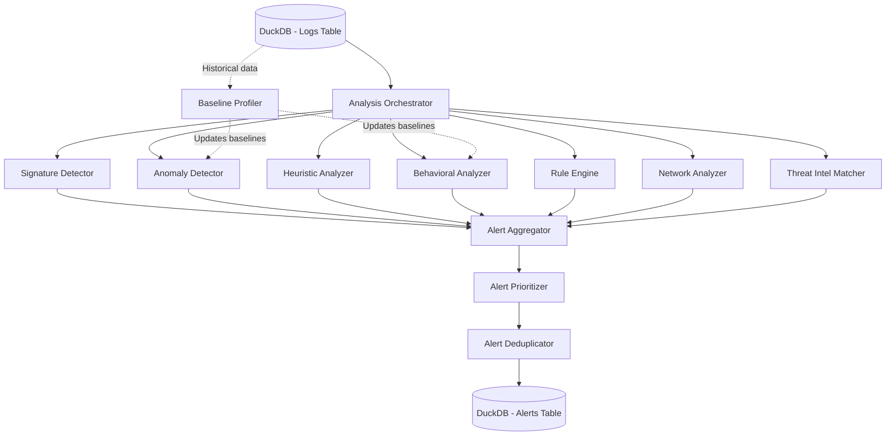

# Analysis Layer - Detailed Implementation Plan

A comprehensive plan for implementing the analysis and detection engine for the log analyzer tool.

## Overview

The analysis layer is the core intelligence component that processes logs from DuckDB and identifies cyber security threats using multiple detection methods. It operates on a continuous cycle, analyzing new logs approximately every 1 minute as they are ingested by the existing microservice.

## Architecture

### High-Level Flow



### Component Interaction

1. **Analysis Orchestrator**: Coordinates all detection engines
2. **Detection Engines**: 7 parallel detection methods
3. **Alert Aggregator**: Collects alerts from all engines
4. **Alert Prioritizer**: Scores and ranks alerts
5. **Alert Deduplicator**: Removes duplicate/similar alerts
6. **Baseline Profiler**: Maintains behavioral baselines (runs periodically)

---

## Core Components

### 1. Analysis Orchestrator

**File**: `backend/analyzers/orchestrator.py`

**Purpose**: Main coordinator that manages the analysis pipeline

**Key Responsibilities**:
- Fetch new logs from DuckDB (last 1 minute)
- Distribute logs to all detection engines in parallel
- Collect and aggregate results
- Handle errors and retries
- Track performance metrics

**Implementation Details**:

```python
class AnalysisOrchestrator:
    def __init__(self, db_manager, detectors):
        self.db_manager = db_manager
        self.detectors = detectors  # List of all detector instances
        self.last_processed_timestamp = None
        
    async def run_analysis_cycle(self):
        """Main analysis loop - runs every ~1 minute"""
        # 1. Fetch new logs
        new_logs = await self.fetch_new_logs()
        
        if not new_logs:
            return
        
        # 2. Run all detectors in parallel
        detection_tasks = [
            detector.analyze(new_logs) 
            for detector in self.detectors
        ]
        results = await asyncio.gather(*detection_tasks, return_exceptions=True)
        
        # 3. Aggregate alerts
        all_alerts = self.aggregate_results(results)
        
        # 4. Prioritize and deduplicate
        prioritized_alerts = self.prioritize_alerts(all_alerts)
        unique_alerts = self.deduplicate_alerts(prioritized_alerts)
        
        # 5. Store alerts
        await self.store_alerts(unique_alerts)
        
        # 6. Update timestamp
        self.last_processed_timestamp = max(log.timestamp for log in new_logs)
```

**Configuration**:
```yaml
orchestrator:
  analysis_interval: 60  # seconds
  batch_size: 10000  # max logs per cycle
  parallel_execution: true
  timeout_per_detector: 30  # seconds
  retry_on_failure: true
  max_retries: 3
```

---

## Detection Methods

### 1. Signature-Based Detection

**File**: `backend/analyzers/signature_detector.py`

**Purpose**: Match logs against known attack patterns and signatures

**Detection Approach**:
- Pattern matching using regex and string matching
- YARA-style rule definitions
- Hash-based detection for known malware/exploits
- Protocol-specific signatures (SQL injection, XSS, command injection, etc.)

**Signature Format** (`config/signatures/web_attacks.yaml`):
```yaml
signatures:
  - id: SIG-001
    name: SQL Injection Attempt
    severity: high
    category: web_attack
    patterns:
      - regex: "(?i)(union.*select|select.*from|insert.*into|delete.*from|drop.*table)"
      - regex: "(?i)(or\\s+1\\s*=\\s*1|'\\s*or\\s*'1'\\s*=\\s*'1)"
    fields:
      - raw_log
      - parsed_fields.query_string
      - parsed_fields.post_data
    
  - id: SIG-002
    name: XSS Attempt
    severity: medium
    category: web_attack
    patterns:
      - regex: "(?i)<script[^>]*>.*?</script>"
      - regex: "(?i)javascript:\\s*"
      - regex: "(?i)on(load|error|click)\\s*="
    fields:
      - raw_log
      - parsed_fields.user_input
```

**Implementation**:
```python
class SignatureDetector:
    def __init__(self, signature_dir):
        self.signatures = self.load_signatures(signature_dir)
        self.compiled_patterns = self.compile_patterns()
    
    async def analyze(self, logs):
        alerts = []
        
        for log in logs:
            for signature in self.signatures:
                if self.match_signature(log, signature):
                    alert = self.create_alert(log, signature)
                    alerts.append(alert)
        
        return alerts
    
    def match_signature(self, log, signature):
        """Check if log matches signature patterns"""
        for field in signature['fields']:
            field_value = self.extract_field(log, field)
            if not field_value:
                continue
                
            for pattern in signature['patterns']:
                if pattern['regex']:
                    if re.search(pattern['regex'], field_value):
                        return True
        return False
```

**Signature Categories**:
1. **Web Attacks**: SQL injection, XSS, CSRF, path traversal
2. **Network Attacks**: Port scanning, DDoS, protocol anomalies
3. **Authentication**: Brute force, credential stuffing, password spraying
4. **Malware**: Known malware signatures, C2 communication patterns
5. **Data Exfiltration**: Large data transfers, unusual protocols
6. **Privilege Escalation**: Sudo abuse, UAC bypass attempts
7. **Lateral Movement**: Pass-the-hash, remote execution

**Performance Optimization**:
- Compile regex patterns once at startup
- Use efficient string matching algorithms (Boyer-Moore, Aho-Corasick)
- Index signatures by event type for faster lookup
- Parallel processing of logs

---

### 2. Anomaly Detection

**File**: `backend/analyzers/anomaly_detector.py`

**Purpose**: Detect unusual patterns that deviate from normal behavior

**Detection Techniques**:

#### A. Statistical Anomaly Detection
- **Z-Score Analysis**: Detect outliers based on standard deviation
- **IQR Method**: Identify values outside interquartile range
- **Moving Average**: Detect sudden spikes or drops

#### B. Machine Learning Anomaly Detection
- **Isolation Forest**: Unsupervised learning for outlier detection
- **One-Class SVM**: Learn normal behavior boundary
- **Autoencoders**: Neural network-based anomaly detection (optional)

#### C. Time-Series Anomaly Detection
- **Seasonal Decomposition**: Detect anomalies in time-series data
- **ARIMA**: Forecast expected values and detect deviations

**Metrics to Monitor**:
```python
ANOMALY_METRICS = {
    'login_frequency': {
        'field': 'event_type',
        'filter': {'event_type': 'login'},
        'aggregation': 'count',
        'window': '1h',
        'method': 'z_score',
        'threshold': 3.0
    },
    'failed_login_rate': {
        'field': 'event_type',
        'filter': {'event_type': 'login_failed'},
        'aggregation': 'count',
        'window': '5m',
        'method': 'moving_average',
        'threshold': 2.0
    },
    'data_transfer_volume': {
        'field': 'parsed_fields.bytes_transferred',
        'aggregation': 'sum',
        'window': '10m',
        'method': 'iqr',
        'threshold': 1.5
    },
    'unique_destinations': {
        'field': 'dest_ip',
        'aggregation': 'count_distinct',
        'window': '1h',
        'method': 'isolation_forest',
        'threshold': 0.1  # contamination rate
    }
}
```

**Implementation**:
```python
from sklearn.ensemble import IsolationForest
import numpy as np

class AnomalyDetector:
    def __init__(self, baseline_manager):
        self.baseline_manager = baseline_manager
        self.models = {}
        self.initialize_models()
    
    async def analyze(self, logs):
        alerts = []
        
        # Group logs by metric
        for metric_name, metric_config in ANOMALY_METRICS.items():
            metric_values = self.extract_metric_values(logs, metric_config)
            
            if not metric_values:
                continue
            
            # Detect anomalies
            anomalies = self.detect_anomalies(
                metric_name, 
                metric_values, 
                metric_config
            )
            
            # Create alerts for anomalies
            for anomaly in anomalies:
                alert = self.create_anomaly_alert(anomaly, metric_name)
                alerts.append(alert)
        
        return alerts
    
    def detect_anomalies(self, metric_name, values, config):
        method = config['method']
        
        if method == 'z_score':
            return self.z_score_detection(values, config['threshold'])
        elif method == 'iqr':
            return self.iqr_detection(values, config['threshold'])
        elif method == 'isolation_forest':
            return self.isolation_forest_detection(values, config['threshold'])
        elif method == 'moving_average':
            return self.moving_average_detection(values, config['threshold'])
    
    def z_score_detection(self, values, threshold):
        """Detect outliers using z-score"""
        mean = np.mean(values)
        std = np.std(values)
        
        if std == 0:
            return []
        
        z_scores = [(v - mean) / std for v in values]
        anomalies = [
            {'value': v, 'z_score': z, 'index': i}
            for i, (v, z) in enumerate(zip(values, z_scores))
            if abs(z) > threshold
        ]
        return anomalies
    
    def isolation_forest_detection(self, values, contamination):
        """Detect anomalies using Isolation Forest"""
        if len(values) < 10:
            return []
        
        X = np.array(values).reshape(-1, 1)
        
        model = IsolationForest(
            contamination=contamination,
            random_state=42
        )
        predictions = model.fit_predict(X)
        
        anomalies = [
            {'value': values[i], 'score': model.score_samples(X)[i], 'index': i}
            for i in range(len(values))
            if predictions[i] == -1
        ]
        return anomalies
```

**Baseline Management**:
```python
class BaselineManager:
    """Maintains historical baselines for anomaly detection"""
    
    def __init__(self, db_manager):
        self.db_manager = db_manager
        self.baselines = {}
    
    async def update_baselines(self):
        """Update baselines using historical data (runs daily)"""
        for metric_name, metric_config in ANOMALY_METRICS.items():
            # Fetch last 30 days of data
            historical_data = await self.fetch_historical_data(
                metric_config, 
                days=30
            )
            
            # Calculate baseline statistics
            baseline = {
                'mean': np.mean(historical_data),
                'std': np.std(historical_data),
                'median': np.median(historical_data),
                'q1': np.percentile(historical_data, 25),
                'q3': np.percentile(historical_data, 75),
                'min': np.min(historical_data),
                'max': np.max(historical_data),
                'updated_at': datetime.now()
            }
            
            self.baselines[metric_name] = baseline
            
            # Store in database
            await self.store_baseline(metric_name, baseline)
```

---

### 3. Heuristic Analysis

**File**: `backend/analyzers/heuristic_analyzer.py`

**Purpose**: Apply rule-of-thumb based detection for common attack patterns

**Heuristic Rules**:

```python
HEURISTIC_RULES = [
    {
        'id': 'HEUR-001',
        'name': 'Multiple Failed Logins Followed by Success',
        'severity': 'high',
        'description': 'Potential brute force attack',
        'conditions': {
            'window': '5m',
            'sequence': [
                {'event_type': 'login_failed', 'min_count': 5},
                {'event_type': 'login_success', 'count': 1}
            ],
            'group_by': ['source_ip', 'user']
        }
    },
    {
        'id': 'HEUR-002',
        'name': 'Privilege Escalation After Login',
        'severity': 'critical',
        'description': 'User gained elevated privileges shortly after login',
        'conditions': {
            'window': '10m',
            'sequence': [
                {'event_type': 'login_success'},
                {'event_type': 'privilege_escalation'}
            ],
            'group_by': ['user']
        }
    },
    {
        'id': 'HEUR-003',
        'name': 'Lateral Movement Pattern',
        'severity': 'high',
        'description': 'User accessing multiple systems in short time',
        'conditions': {
            'window': '15m',
            'unique_count': {
                'field': 'dest_ip',
                'threshold': 10
            },
            'group_by': ['source_ip', 'user']
        }
    },
    {
        'id': 'HEUR-004',
        'name': 'Data Exfiltration Indicator',
        'severity': 'critical',
        'description': 'Large data transfer to external IP',
        'conditions': {
            'window': '5m',
            'sum': {
                'field': 'parsed_fields.bytes_transferred',
                'threshold': 100000000  # 100MB
            },
            'filter': {
                'dest_ip_type': 'external'
            },
            'group_by': ['source_ip']
        }
    },
    {
        'id': 'HEUR-005',
        'name': 'Off-Hours Activity',
        'severity': 'medium',
        'description': 'Unusual activity during off-hours',
        'conditions': {
            'time_range': {
                'start': '22:00',
                'end': '06:00'
            },
            'event_types': ['login_success', 'file_access', 'data_transfer'],
            'group_by': ['user']
        }
    }
]
```

**Implementation**:
```python
class HeuristicAnalyzer:
    def __init__(self, db_manager):
        self.db_manager = db_manager
        self.rules = HEURISTIC_RULES
    
    async def analyze(self, logs):
        alerts = []
        
        for rule in self.rules:
            matches = await self.evaluate_rule(logs, rule)
            
            for match in matches:
                alert = self.create_heuristic_alert(match, rule)
                alerts.append(alert)
        
        return alerts
    
    async def evaluate_rule(self, logs, rule):
        """Evaluate a heuristic rule against logs"""
        conditions = rule['conditions']
        
        if 'sequence' in conditions:
            return await self.evaluate_sequence_rule(logs, rule)
        elif 'unique_count' in conditions:
            return await self.evaluate_unique_count_rule(logs, rule)
        elif 'sum' in conditions:
            return await self.evaluate_sum_rule(logs, rule)
        elif 'time_range' in conditions:
            return await self.evaluate_time_range_rule(logs, rule)
    
    async def evaluate_sequence_rule(self, logs, rule):
        """Detect event sequences"""
        matches = []
        window = parse_duration(rule['conditions']['window'])
        sequence = rule['conditions']['sequence']
        group_by = rule['conditions'].get('group_by', [])
        
        # Group logs by specified fields
        grouped_logs = self.group_logs(logs, group_by)
        
        for group_key, group_logs in grouped_logs.items():
            # Sort by timestamp
            sorted_logs = sorted(group_logs, key=lambda x: x.timestamp)
            
            # Check for sequence
            if self.matches_sequence(sorted_logs, sequence, window):
                matches.append({
                    'group_key': group_key,
                    'logs': sorted_logs,
                    'rule_id': rule['id']
                })
        
        return matches
```

---

### 4. Behavioral Analysis (UEBA)

**File**: `backend/analyzers/behavioral_analyzer.py`

**Purpose**: User and Entity Behavior Analytics - detect deviations from normal user/entity behavior

**Behavioral Profiles**:

```python
class UserProfile:
    """Profile for a single user"""
    def __init__(self, user_id):
        self.user_id = user_id
        self.typical_login_times = []  # Hour of day distribution
        self.typical_login_days = []   # Day of week distribution
        self.typical_source_ips = set()
        self.typical_accessed_resources = set()
        self.typical_actions = {}  # Action frequency
        self.peer_group = None  # Similar users
        self.risk_score = 0.0
```

**Behavioral Metrics**:
```python
BEHAVIORAL_METRICS = {
    'unusual_login_time': {
        'description': 'Login outside typical hours',
        'weight': 0.7,
        'threshold': 0.05  # Probability threshold
    },
    'unusual_login_location': {
        'description': 'Login from unusual IP/location',
        'weight': 0.8,
        'threshold': 0.1
    },
    'unusual_resource_access': {
        'description': 'Accessing resources not typically accessed',
        'weight': 0.6,
        'threshold': 0.15
    },
    'unusual_action_frequency': {
        'description': 'Performing actions at unusual frequency',
        'weight': 0.5,
        'threshold': 2.0  # Z-score threshold
    },
    'peer_group_deviation': {
        'description': 'Behavior differs from peer group',
        'weight': 0.6,
        'threshold': 0.2
    }
}
```

**Implementation**:
```python
class BehavioralAnalyzer:
    def __init__(self, db_manager, profile_manager):
        self.db_manager = db_manager
        self.profile_manager = profile_manager
    
    async def analyze(self, logs):
        alerts = []
        
        # Group logs by user
        user_logs = self.group_by_user(logs)
        
        for user_id, user_logs_list in user_logs.items():
            # Get user profile
            profile = await self.profile_manager.get_profile(user_id)
            
            if not profile:
                # New user, create profile
                continue
            
            # Analyze each behavioral metric
            for metric_name, metric_config in BEHAVIORAL_METRICS.items():
                deviation_score = self.calculate_deviation(
                    user_logs_list,
                    profile,
                    metric_name,
                    metric_config
                )
                
                if deviation_score > metric_config['threshold']:
                    alert = self.create_behavioral_alert(
                        user_id,
                        metric_name,
                        deviation_score,
                        user_logs_list
                    )
                    alerts.append(alert)
        
        return alerts
    
    def calculate_deviation(self, logs, profile, metric_name, config):
        """Calculate deviation score for a behavioral metric"""
        if metric_name == 'unusual_login_time':
            return self.calculate_time_deviation(logs, profile)
        elif metric_name == 'unusual_login_location':
            return self.calculate_location_deviation(logs, profile)
        elif metric_name == 'unusual_resource_access':
            return self.calculate_resource_deviation(logs, profile)
        # ... other metrics
    
    def calculate_time_deviation(self, logs, profile):
        """Calculate how unusual the login times are"""
        login_hours = [log.timestamp.hour for log in logs if log.event_type == 'login']
        
        if not login_hours:
            return 0.0
        
        # Calculate probability based on historical distribution
        typical_distribution = profile.typical_login_times
        
        unusual_count = 0
        for hour in login_hours:
            probability = typical_distribution.get(hour, 0)
            if probability < 0.05:  # Less than 5% of historical logins
                unusual_count += 1
        
        return unusual_count / len(login_hours)
```

**Profile Building**:
```python
class ProfileManager:
    """Manages user behavioral profiles"""
    
    async def build_profile(self, user_id, lookback_days=30):
        """Build user profile from historical data"""
        # Fetch historical logs
        historical_logs = await self.fetch_user_logs(user_id, lookback_days)
        
        profile = UserProfile(user_id)
        
        # Build login time distribution
        login_hours = [log.timestamp.hour for log in historical_logs 
                      if log.event_type == 'login']
        profile.typical_login_times = self.build_distribution(login_hours)
        
        # Build login day distribution
        login_days = [log.timestamp.weekday() for log in historical_logs 
                     if log.event_type == 'login']
        profile.typical_login_days = self.build_distribution(login_days)
        
        # Collect typical source IPs
        profile.typical_source_ips = set(
            log.source_ip for log in historical_logs
        )
        
        # Collect typical accessed resources
        profile.typical_accessed_resources = set(
            log.parsed_fields.get('resource') for log in historical_logs
            if log.parsed_fields.get('resource')
        )
        
        # Calculate action frequencies
        profile.typical_actions = self.calculate_action_frequencies(historical_logs)
        
        # Assign peer group
        profile.peer_group = await self.assign_peer_group(profile)
        
        return profile
    
    async def update_profiles(self):
        """Update all user profiles (runs daily)"""
        users = await self.get_all_users()
        
        for user_id in users:
            profile = await self.build_profile(user_id)
            await self.store_profile(profile)
```

---

### 5. Rule-Based Detection

**File**: `backend/analyzers/rule_engine.py`

**Purpose**: Evaluate custom correlation rules (Sigma-style rules)

**Rule Format** (`config/rules/mitre_attack.yaml`):
```yaml
rules:
  - id: RULE-001
    name: T1078 - Valid Accounts
    mitre_attack:
      technique: T1078
      tactic: Initial Access
    severity: medium
    description: Detect use of valid accounts for initial access
    logic:
      condition: selection
      selection:
        event_type: login_success
        source_ip_type: external
        user_type: privileged
    
  - id: RULE-002
    name: T1110 - Brute Force
    mitre_attack:
      technique: T1110
      tactic: Credential Access
    severity: high
    description: Detect brute force attempts
    logic:
      condition: selection and count
      selection:
        event_type: login_failed
      count:
        field: source_ip
        threshold: 10
        timeframe: 5m
    
  - id: RULE-003
    name: T1071 - Application Layer Protocol (C2)
    mitre_attack:
      technique: T1071
      tactic: Command and Control
    severity: critical
    description: Detect potential C2 communication
    logic:
      condition: selection and frequency
      selection:
        protocol: http
        dest_port: [8080, 8443, 4444]
        dest_ip_type: external
      frequency:
        field: dest_ip
        min_connections: 50
        timeframe: 10m
```

**Implementation**:
```python
class RuleEngine:
    def __init__(self, rule_dir, db_manager):
        self.rules = self.load_rules(rule_dir)
        self.db_manager = db_manager
    
    async def analyze(self, logs):
        alerts = []
        
        for rule in self.rules:
            if not rule.get('enabled', True):
                continue
            
            matches = await self.evaluate_rule(logs, rule)
            
            for match in matches:
                alert = self.create_rule_alert(match, rule)
                alerts.append(alert)
        
        return alerts
    
    async def evaluate_rule(self, logs, rule):
        """Evaluate a correlation rule"""
        logic = rule['logic']
        condition = logic['condition']
        
        # Parse condition (e.g., "selection and count")
        conditions = condition.split(' and ')
        
        # Apply selection filter
        if 'selection' in logic:
            filtered_logs = self.apply_selection(logs, logic['selection'])
        else:
            filtered_logs = logs
        
        # Apply additional conditions
        for cond in conditions:
            if cond == 'selection':
                continue
            elif cond == 'count':
                filtered_logs = self.apply_count_condition(
                    filtered_logs, 
                    logic['count']
                )
            elif cond == 'frequency':
                filtered_logs = self.apply_frequency_condition(
                    filtered_logs,
                    logic['frequency']
                )
        
        return filtered_logs
    
    def apply_selection(self, logs, selection):
        """Filter logs based on selection criteria"""
        filtered = []
        
        for log in logs:
            if self.matches_selection(log, selection):
                filtered.append(log)
        
        return filtered
    
    def matches_selection(self, log, selection):
        """Check if log matches selection criteria"""
        for field, value in selection.items():
            log_value = self.get_field_value(log, field)
            
            if isinstance(value, list):
                if log_value not in value:
                    return False
            else:
                if log_value != value:
                    return False
        
        return True
```

---

### 6. Network Traffic Analysis

**File**: `backend/analyzers/network_analyzer.py`

**Purpose**: Analyze network flow logs for suspicious patterns

**Analysis Techniques**:

1. **Port Scanning Detection**
2. **DDoS Detection**
3. **Protocol Anomalies**
4. **Bandwidth Anomalies**
5. **Beaconing Detection** (C2 communication)
6. **DNS Tunneling Detection**

**Implementation**:
```python
class NetworkAnalyzer:
    def __init__(self, db_manager):
        self.db_manager = db_manager
    
    async def analyze(self, logs):
        alerts = []
        
        # Filter network-related logs
        network_logs = [log for log in logs if log.event_type in [
            'network_connection', 'dns_query', 'http_request'
        ]]
        
        # Run network analysis techniques
        alerts.extend(await self.detect_port_scanning(network_logs))
        alerts.extend(await self.detect_ddos(network_logs))
        alerts.extend(await self.detect_beaconing(network_logs))
        alerts.extend(await self.detect_dns_tunneling(network_logs))
        
        return alerts
    
    async def detect_port_scanning(self, logs):
        """Detect port scanning activity"""
        alerts = []
        
        # Group by source IP
        by_source = {}
        for log in logs:
            source_ip = log.source_ip
            if source_ip not in by_source:
                by_source[source_ip] = []
            by_source[source_ip].append(log)
        
        # Check for scanning patterns
        for source_ip, source_logs in by_source.items():
            # Count unique destination ports
            unique_ports = set(log.dest_port for log in source_logs)
            
            # Threshold: >20 unique ports in 1 minute
            if len(unique_ports) > 20:
                alerts.append({
                    'type': 'port_scan',
                    'source_ip': source_ip,
                    'unique_ports': len(unique_ports),
                    'severity': 'high'
                })
        
        return alerts
    
    async def detect_beaconing(self, logs):
        """Detect C2 beaconing (regular periodic connections)"""
        alerts = []
        
        # Group by source IP and destination IP
        connections = {}
        for log in logs:
            key = (log.source_ip, log.dest_ip)
            if key not in connections:
                connections[key] = []
            connections[key].append(log.timestamp)
        
        # Analyze connection intervals
        for (source_ip, dest_ip), timestamps in connections.items():
            if len(timestamps) < 5:
                continue
            
            # Calculate intervals
            sorted_times = sorted(timestamps)
            intervals = [
                (sorted_times[i+1] - sorted_times[i]).total_seconds()
                for i in range(len(sorted_times) - 1)
            ]
            
            # Check for regular intervals (low variance)
            if len(intervals) > 0:
                mean_interval = np.mean(intervals)
                std_interval = np.std(intervals)
                
                # Coefficient of variation < 0.2 indicates regular beaconing
                if std_interval / mean_interval < 0.2:
                    alerts.append({
                        'type': 'beaconing',
                        'source_ip': source_ip,
                        'dest_ip': dest_ip,
                        'interval': mean_interval,
                        'severity': 'critical'
                    })
        
        return alerts
```

---

### 7. Threat Intelligence Matching

**File**: `backend/analyzers/threat_intel_matcher.py`

**Purpose**: Match log indicators against threat intelligence feeds

**Indicator Types**:
- IP addresses (malicious IPs, C2 servers)
- Domain names (malicious domains, phishing sites)
- File hashes (malware hashes)
- URLs (malicious URLs)
- Email addresses (phishing emails)

**Implementation**:
```python
class ThreatIntelMatcher:
    def __init__(self, db_manager):
        self.db_manager = db_manager
        self.threat_intel_cache = {}
        self.load_threat_intel()
    
    async def analyze(self, logs):
        alerts = []
        
        for log in logs:
            # Extract indicators from log
            indicators = self.extract_indicators(log)
            
            # Check each indicator against threat intel
            for indicator_type, indicator_value in indicators:
                match = await self.check_threat_intel(
                    indicator_type,
                    indicator_value
                )
                
                if match:
                    alert = self.create_threat_intel_alert(
                        log,
                        indicator_type,
                        indicator_value,
                        match
                    )
                    alerts.append(alert)
        
        return alerts
    
    def extract_indicators(self, log):
        """Extract IoCs from log"""
        indicators = []
        
        # IP addresses
        if log.source_ip:
            indicators.append(('ip', log.source_ip))
        if log.dest_ip:
            indicators.append(('ip', log.dest_ip))
        
        # Domains
        if log.parsed_fields.get('domain'):
            indicators.append(('domain', log.parsed_fields['domain']))
        
        # URLs
        if log.parsed_fields.get('url'):
            indicators.append(('url', log.parsed_fields['url']))
        
        # File hashes
        if log.parsed_fields.get('file_hash'):
            indicators.append(('hash', log.parsed_fields['file_hash']))
        
        return indicators
    
    async def check_threat_intel(self, indicator_type, indicator_value):
        """Check if indicator exists in threat intel database"""
        # Check cache first
        cache_key = f"{indicator_type}:{indicator_value}"
        if cache_key in self.threat_intel_cache:
            return self.threat_intel_cache[cache_key]
        
        # Query database
        query = """
            SELECT * FROM threat_intel
            WHERE indicator_type = ?
            AND indicator_value = ?
            AND (expires_at IS NULL OR expires_at > CURRENT_TIMESTAMP)
        """
        
        result = await self.db_manager.execute_query(
            query,
            (indicator_type, indicator_value)
        )
        
        # Cache result
        self.threat_intel_cache[cache_key] = result
        
        return result
    
    async def load_threat_intel(self):
        """Load threat intel into memory cache"""
        query = """
            SELECT indicator_type, indicator_value, threat_type, confidence
            FROM threat_intel
            WHERE expires_at IS NULL OR expires_at > CURRENT_TIMESTAMP
        """
        
        results = await self.db_manager.execute_query(query)
        
        for row in results:
            cache_key = f"{row['indicator_type']}:{row['indicator_value']}"
            self.threat_intel_cache[cache_key] = row
```

---

## Alert Management

### Alert Aggregation

**Purpose**: Collect alerts from all detection engines

```python
class AlertAggregator:
    def aggregate(self, detection_results):
        """Aggregate alerts from all detectors"""
        all_alerts = []
        
        for detector_name, alerts in detection_results.items():
            for alert in alerts:
                alert['detector'] = detector_name
                all_alerts.append(alert)
        
        return all_alerts
```

### Alert Prioritization

**Purpose**: Score and rank alerts by severity and confidence

```python
class AlertPrioritizer:
    SEVERITY_SCORES = {
        'critical': 100,
        'high': 75,
        'medium': 50,
        'low': 25,
        'info': 10
    }
    
    def prioritize(self, alerts):
        """Calculate priority score for each alert"""
        for alert in alerts:
            score = self.calculate_priority_score(alert)
            alert['priority_score'] = score
        
        # Sort by priority score (descending)
        return sorted(alerts, key=lambda x: x['priority_score'], reverse=True)
    
    def calculate_priority_score(self, alert):
        """Calculate priority score based on multiple factors"""
        score = 0
        
        # Base score from severity
        severity = alert.get('severity', 'low')
        score += self.SEVERITY_SCORES.get(severity, 10)
        
        # Confidence multiplier
        confidence = alert.get('confidence', 0.5)
        score *= confidence
        
        # Detection method weight
        detector_weights = {
            'signature_detector': 1.0,
            'threat_intel_matcher': 1.2,
            'behavioral_analyzer': 0.9,
            'anomaly_detector': 0.8,
            'heuristic_analyzer': 0.85,
            'rule_engine': 1.0,
            'network_analyzer': 0.9
        }
        detector = alert.get('detector', '')
        weight = detector_weights.get(detector, 1.0)
        score *= weight
        
        # Asset criticality (if available)
        asset_criticality = alert.get('asset_criticality', 1.0)
        score *= asset_criticality
        
        return score
```

### Alert Deduplication

**Purpose**: Remove duplicate or similar alerts

```python
class AlertDeduplicator:
    def deduplicate(self, alerts, time_window=300):
        """Remove duplicate alerts within time window"""
        unique_alerts = []
        seen_signatures = set()
        
        for alert in alerts:
            # Create signature for alert
            signature = self.create_alert_signature(alert)
            
            # Check if we've seen this alert recently
            if signature not in seen_signatures:
                unique_alerts.append(alert)
                seen_signatures.add(signature)
        
        return unique_alerts
    
    def create_alert_signature(self, alert):
        """Create unique signature for alert"""
        # Combine key fields to create signature
        signature_parts = [
            alert.get('type', ''),
            alert.get('source_ip', ''),
            alert.get('dest_ip', ''),
            alert.get('user', ''),
            alert.get('detector', '')
        ]
        
        return '|'.join(str(p) for p in signature_parts)
```

---

## Configuration

### Main Configuration File

**File**: `config/analysis.yaml`

```yaml
analysis:
  # Orchestrator settings
  orchestrator:
    interval: 60  # seconds
    batch_size: 10000
    parallel_execution: true
    timeout: 30
    
  # Detector settings
  detectors:
    signature_detector:
      enabled: true
      signature_dir: config/signatures/
      cache_patterns: true
      
    anomaly_detector:
      enabled: true
      methods: [z_score, isolation_forest, iqr]
      baseline_update_interval: 86400  # daily
      
    heuristic_analyzer:
      enabled: true
      rules_file: config/heuristics.yaml
      
    behavioral_analyzer:
      enabled: true
      profile_update_interval: 86400  # daily
      lookback_days: 30
      
    rule_engine:
      enabled: true
      rules_dir: config/rules/
      
    network_analyzer:
      enabled: true
      port_scan_threshold: 20
      beaconing_variance_threshold: 0.2
      
    threat_intel_matcher:
      enabled: true
      cache_size: 100000
      cache_ttl: 3600
      
  # Alert settings
  alerts:
    deduplication_window: 300  # seconds
    min_priority_score: 10
    max_alerts_per_cycle: 1000
```

---

## Performance Optimization

### 1. Parallel Processing
```python
# Run detectors in parallel using asyncio
results = await asyncio.gather(*[
    detector.analyze(logs) for detector in detectors
])
```

### 2. Caching
```python
# Cache threat intel, signatures, baselines
from functools import lru_cache

@lru_cache(maxsize=10000)
def get_threat_intel(indicator_type, indicator_value):
    # ...
```

### 3. Database Indexing
```sql
-- Index for fast time-range queries
CREATE INDEX idx_logs_timestamp ON logs(timestamp);

-- Index for IP lookups
CREATE INDEX idx_logs_source_ip ON logs(source_ip);
CREATE INDEX idx_logs_dest_ip ON logs(dest_ip);

-- Index for event type filtering
CREATE INDEX idx_logs_event_type ON logs(event_type);
```

### 4. Batch Processing
```python
# Process logs in batches
BATCH_SIZE = 1000
for i in range(0, len(logs), BATCH_SIZE):
    batch = logs[i:i+BATCH_SIZE]
    process_batch(batch)
```

---

## Monitoring & Metrics

### Performance Metrics

```python
METRICS = {
    'analysis_cycle_duration': 'Time taken for one analysis cycle',
    'logs_processed_per_cycle': 'Number of logs processed',
    'alerts_generated_per_cycle': 'Number of alerts generated',
    'detector_execution_time': 'Time taken by each detector',
    'false_positive_rate': 'Rate of false positive alerts',
    'detection_accuracy': 'Accuracy of detections'
}
```

### Logging

```python
import structlog

logger = structlog.get_logger()

logger.info(
    "analysis_cycle_completed",
    cycle_duration=duration,
    logs_processed=len(logs),
    alerts_generated=len(alerts)
)
```

---

## Testing Strategy

### Unit Tests
```python
# Test individual detectors
def test_signature_detector():
    detector = SignatureDetector('config/signatures/')
    logs = [create_test_log_with_sql_injection()]
    alerts = detector.analyze(logs)
    assert len(alerts) == 1
    assert alerts[0]['type'] == 'sql_injection'
```

### Integration Tests
```python
# Test full analysis pipeline
async def test_analysis_pipeline():
    orchestrator = AnalysisOrchestrator(db_manager, detectors)
    logs = create_test_logs()
    await orchestrator.run_analysis_cycle()
    alerts = await db_manager.fetch_alerts()
    assert len(alerts) > 0
```

### Performance Tests
```python
# Test with large log volumes
async def test_high_volume_analysis():
    logs = create_test_logs(count=100000)
    start = time.time()
    await orchestrator.run_analysis_cycle()
    duration = time.time() - start
    assert duration < 60  # Should complete within 1 minute
```

---

## Summary

This detailed plan provides:

1. **7 Detection Methods**: Comprehensive coverage of threat detection techniques
2. **Modular Architecture**: Each detector is independent and pluggable
3. **Scalable Design**: Parallel processing and efficient algorithms
4. **Configurable**: YAML-based configuration for all components
5. **Alert Management**: Aggregation, prioritization, and deduplication
6. **Performance Optimized**: Caching, indexing, batch processing
7. **Testable**: Unit, integration, and performance tests

The analysis layer is designed to be the intelligence core of the log analyzer tool, capable of detecting a wide range of cyber security threats using multiple complementary detection methods.
