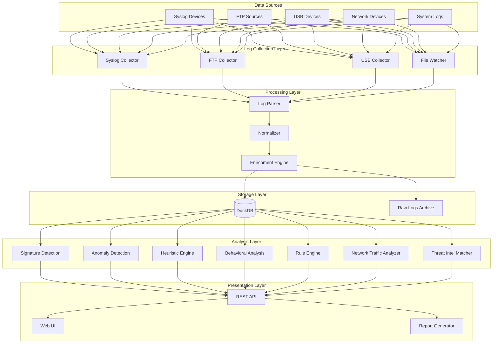
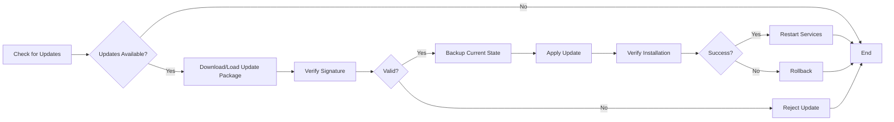

# Log Analyzer Tool - Implementation Plan

A comprehensive plan for building a portable, self-oriented log analysis tool for monitoring cyber security events on isolated networks with DuckDB as the backend storage.

## Problem Summary

The goal is to develop a **portable, fully functional log analysis tool** for Security Operations Centers (SOC) operating on isolated networks. The tool must:

- Operate independently without external cloud dependencies
- Collect, parse, and analyze logs from various sources
- Detect cyber security attacks using multiple detection methods (signatures, anomaly, heuristic, behavioral, rule-based, network traffic analysis, threat intelligence)
- Support deployment across Windows, Linux, and Mac platforms
- Provide a user-friendly interface for both technical and non-technical users
- Function offline with secure log handling
- Include an efficient update mechanism

**Key Assumption**: An existing microservice handles log collection, normalization, and DuckDB storage, populating the database approximately every 1 minute.

> [!IMPORTANT]
> **Existing Infrastructure**: Log collection, parsing, normalization, and DuckDB integration are already implemented via a separate microservice. This plan focuses on building the **analysis engine, user interface, reporting, security, and update mechanisms** that will work with the existing data pipeline.

---

## System Architecture

### High-Level Architecture



### Component Overview

1. **Log Collection Layer** *(Existing Microservice)*: Multi-protocol collectors (Syslog, FTP, USB, file-based)
2. **Processing Layer** *(Existing Microservice)*: Parsing, normalization, and enrichment
3. **Storage Layer** *(Existing Microservice)*: DuckDB for structured data + raw log archival
4. **Analysis Layer** *(To Build)*: Multiple detection engines running in parallel
5. **Presentation Layer** *(To Build)*: Web UI, REST API, and reporting
6. **Security Layer** *(To Build)*: Authentication, authorization, and secure access
7. **Update Layer** *(To Build)*: Rule updates, threat intel updates, software updates

---

## Proposed Changes

### Core Application

#### [NEW] Project Structure

```
log-analyzer-tool/
├── backend/
│   ├── analyzers/           # Detection engines (TO BUILD)
│   ├── api/                 # REST API (TO BUILD)
│   ├── storage/             # DuckDB query interface (TO BUILD)
│   ├── core/                # Core utilities (TO BUILD)
│   └── auth/                # Authentication (TO BUILD)
├── frontend/                # Web UI (TO BUILD)
│   ├── src/
│   │   ├── components/      # React components
│   │   ├── pages/           # UI pages
│   │   ├── services/        # API clients
│   │   └── utils/           # Frontend utilities
├── config/
│   ├── rules/               # Detection rules (TO BUILD)
│   ├── signatures/          # Attack signatures (TO BUILD)
│   └── settings.yaml        # Application settings (TO BUILD)
├── data/
│   ├── duckdb/              # DuckDB database files (EXISTING - managed by microservice)
│   └── archives/            # Raw log archives (EXISTING - managed by microservice)
├── updates/                 # Update packages (TO BUILD)
├── docs/                    # Documentation (TO BUILD)
└── scripts/                 # Deployment scripts (TO BUILD)
```

> [!NOTE]
> **Implementation Scope**: Since log collection, parsing, and DuckDB storage are handled by the existing microservice, this implementation focuses on:
> - **Analysis Engine**: Detection methods and alert generation
> - **Web UI**: Dashboard, log viewer, alerts, reports
> - **REST API**: Backend services for the UI
> - **Security**: Authentication and authorization
> - **Reporting**: Report generation and export
> - **Updates**: Rule and threat intel update mechanism

---

### Integration with Existing Microservice

#### [EXISTING] Log Collection & Storage Microservice

**Status**: Already implemented

**Responsibilities**:
- Collect logs from multiple sources (Syslog, FTP, USB, file monitoring)
- Parse and normalize logs into structured format
- Store normalized logs in DuckDB every ~1 minute
- Maintain raw log archives

**Integration Points**:
- **DuckDB Database**: Shared database that the existing microservice writes to and the new analysis tool reads from
- **Schema Contract**: The analysis tool will query the DuckDB schema created by the microservice
- **Real-time Notifications** *(Optional)*: If the microservice can emit events when new logs are inserted, the analysis engine can react immediately

**What We Need to Know**:
1. DuckDB schema structure (table names, column names, data types)
2. Location of DuckDB database file(s)
3. Update frequency and batch sizes
4. Any existing indexes or partitioning strategy
5. Whether the microservice provides any API/webhook for new data notifications

---

### Backend Components (To Build)

#### [SKIP] Log Collection Module

**Status**: ✅ Already handled by existing microservice

---

#### [SKIP] Log Parsing & Normalization Engine

**Status**: ✅ Already handled by existing microservice

---

#### [REFERENCE] DuckDB Schema

**Status**: ✅ Created and managed by existing microservice

**Purpose**: Understand the existing schema to build queries for analysis

**Expected Schema** *(to be confirmed with actual microservice)*:

**Analysis Tool Requirements**:
- **Read-only access** to logs table
- **Read-write access** to alerts, threat_intel, and detection_rules tables
- **Query patterns**: Time-range queries, aggregations, joins

**Proposed Additional Schema** *(tables the analysis tool will create)*:
```sql
-- Main logs table
CREATE TABLE logs (
    id UUID PRIMARY KEY,
    timestamp TIMESTAMP NOT NULL,
    source_ip VARCHAR,
    dest_ip VARCHAR,
    source_port INTEGER,
    dest_port INTEGER,
    protocol VARCHAR,
    event_type VARCHAR,
    severity VARCHAR,
    user VARCHAR,
    device_name VARCHAR,
    device_type VARCHAR,
    raw_log TEXT,
    parsed_fields JSON,
    ingestion_time TIMESTAMP DEFAULT CURRENT_TIMESTAMP
);

-- Alerts table
CREATE TABLE alerts (
    id UUID PRIMARY KEY,
    log_id UUID REFERENCES logs(id),
    alert_type VARCHAR,
    detection_method VARCHAR,
    severity VARCHAR,
    description TEXT,
    metadata JSON,
    created_at TIMESTAMP DEFAULT CURRENT_TIMESTAMP,
    acknowledged BOOLEAN DEFAULT FALSE
);

-- Threat intelligence table
CREATE TABLE threat_intel (
    id UUID PRIMARY KEY,
    indicator_type VARCHAR,
    indicator_value VARCHAR,
    threat_type VARCHAR,
    confidence FLOAT,
    source VARCHAR,
    metadata JSON,
    created_at TIMESTAMP,
    expires_at TIMESTAMP
);

-- Detection rules table
CREATE TABLE detection_rules (
    id UUID PRIMARY KEY,
    rule_name VARCHAR,
    rule_type VARCHAR,
    rule_definition JSON,
    enabled BOOLEAN DEFAULT TRUE,
    created_at TIMESTAMP,
    updated_at TIMESTAMP
);
```

---

#### [NEW] Analysis & Detection Engine

**File**: `backend/analyzers/detection_engine.py`

**Purpose**: Orchestrate multiple detection methods to identify cyber security threats

**Detection Methods**:

##### 1. Signature-Based Detection
- **File**: `backend/analyzers/signature_detector.py`
- **Method**: Match logs against known attack signatures (YARA-style rules)
- **Examples**: SQL injection patterns, XSS patterns, known malware hashes
- **Configuration**: `config/signatures/*.yaml`

##### 2. Anomaly Detection
- **File**: `backend/analyzers/anomaly_detector.py`
- **Method**: Statistical analysis and machine learning
- **Techniques**:
  - Baseline profiling (normal behavior patterns)
  - Standard deviation analysis
  - Isolation Forest algorithm
  - Time-series anomaly detection
- **Examples**: Unusual login times, abnormal data transfer volumes, spike in failed authentication

##### 3. Heuristic Analysis
- **File**: `backend/analyzers/heuristic_analyzer.py`
- **Method**: Rule-of-thumb based detection
- **Examples**: 
  - Multiple failed logins followed by success
  - Privilege escalation attempts
  - Lateral movement patterns
  - Data exfiltration indicators

##### 4. Behavioral Analysis
- **File**: `backend/analyzers/behavioral_analyzer.py`
- **Method**: User and Entity Behavior Analytics (UEBA)
- **Features**:
  - User profiling
  - Peer group analysis
  - Deviation scoring
- **Examples**: User accessing unusual resources, abnormal command execution

##### 5. Rule-Based Detection
- **File**: `backend/analyzers/rule_engine.py`
- **Method**: Custom correlation rules (similar to Sigma rules)
- **Rule Format**: YAML-based rule definitions
- **Examples**: MITRE ATT&CK technique detection

##### 6. Network Traffic Analysis
- **File**: `backend/analyzers/network_analyzer.py`
- **Method**: Analyze network flow logs
- **Features**:
  - Protocol analysis
  - Connection pattern analysis
  - Bandwidth anomaly detection
  - Port scanning detection

##### 7. Threat Intelligence Integration
- **File**: `backend/analyzers/threat_intel_matcher.py`
- **Method**: Match indicators against threat intel feeds
- **Features**:
  - IP reputation checking
  - Domain reputation checking
  - Hash matching
  - Offline threat intel database

**Analysis Pipeline**:
```python
# Pseudo-code for analysis flow
def analyze_logs():
    # Fetch new logs from DuckDB (last 1 minute)
    new_logs = fetch_recent_logs()
    
    # Run all detection methods in parallel
    results = parallel_execute([
        signature_detector.detect(new_logs),
        anomaly_detector.detect(new_logs),
        heuristic_analyzer.analyze(new_logs),
        behavioral_analyzer.analyze(new_logs),
        rule_engine.evaluate(new_logs),
        network_analyzer.analyze(new_logs),
        threat_intel_matcher.match(new_logs)
    ])
    
    # Aggregate and prioritize alerts
    alerts = aggregate_results(results)
    
    # Store alerts in DuckDB
    store_alerts(alerts)
```

---

#### [NEW] REST API

**File**: `backend/api/main.py`

**Purpose**: Provide REST API for frontend and external integrations

**Technology**: FastAPI (Python) or Express.js (Node.js)

**Key Endpoints**:

```
# Dashboard & Statistics
GET  /api/v1/dashboard/stats
GET  /api/v1/dashboard/timeline

# Logs
GET  /api/v1/logs?start_time=&end_time=&severity=&event_type=&search=
GET  /api/v1/logs/{id}

# Alerts
GET  /api/v1/alerts?severity=&acknowledged=&start_time=&end_time=
GET  /api/v1/alerts/{id}
POST /api/v1/alerts/{id}/acknowledge
GET  /api/v1/alerts/summary

# Search & Filtering
POST /api/v1/search
GET  /api/v1/filters/event-types
GET  /api/v1/filters/devices

# Detection Rules
GET  /api/v1/rules
POST /api/v1/rules
PUT  /api/v1/rules/{id}
DELETE /api/v1/rules/{id}

# Threat Intelligence
GET  /api/v1/threat-intel
POST /api/v1/threat-intel/import

# Reports
GET  /api/v1/reports
POST /api/v1/reports/generate
GET  /api/v1/reports/{id}/download

# System Health
GET  /api/v1/health
GET  /api/v1/collectors/status
GET  /api/v1/storage/stats

# Authentication
POST /api/v1/auth/login
POST /api/v1/auth/logout
GET  /api/v1/auth/user
```

---

### Frontend Components

#### [NEW] Web-Based User Interface

**Technology Stack**: React.js + TypeScript + Vite

**Key Pages & Components**:

##### 1. Dashboard
- **File**: `frontend/src/pages/Dashboard.tsx`
- **Features**:
  - Real-time statistics (total logs, alerts, critical events)
  - Timeline visualization of events
  - Top event types chart
  - Top source IPs
  - Alert severity distribution
  - System health indicators

##### 2. Log Viewer
- **File**: `frontend/src/pages/LogViewer.tsx`
- **Features**:
  - Searchable log table with pagination
  - Advanced filtering (time range, severity, event type, source IP, etc.)
  - Log detail modal
  - Export functionality (CSV, JSON)
  - Syntax highlighting for raw logs

##### 3. Alerts Management
- **File**: `frontend/src/pages/Alerts.tsx`
- **Features**:
  - Alert list with severity badges
  - Filter by severity, acknowledgment status, time range
  - Alert detail view with related logs
  - Acknowledge/dismiss alerts
  - Alert timeline

##### 4. Detection Rules
- **File**: `frontend/src/pages/Rules.tsx`
- **Features**:
  - Rule library browser
  - Enable/disable rules
  - Create custom rules (YAML editor with validation)
  - Test rules against historical data
  - Import/export rules

##### 5. Threat Intelligence
- **File**: `frontend/src/pages/ThreatIntel.tsx`
- **Features**:
  - View threat indicators
  - Import threat intel feeds (CSV, STIX)
  - Indicator search
  - Expiration management

##### 6. Reports
- **File**: `frontend/src/pages/Reports.tsx`
- **Features**:
  - Report templates (daily summary, incident report, compliance report)
  - Custom report builder
  - Schedule reports
  - Export formats (PDF, HTML, CSV)

##### 7. Settings
- **File**: `frontend/src/pages/Settings.tsx`
- **Features**:
  - Collector configuration
  - Parser settings
  - Retention policies
  - User management
  - Authentication settings
  - Update management

**UI Design Principles**:
- Clean, modern interface with dark mode support
- Responsive design (desktop-first, but mobile-friendly)
- Accessibility compliant (WCAG 2.1)
- Real-time updates using WebSockets for live data
- Intuitive navigation with breadcrumbs

---

### Security & Authentication

#### [NEW] Authentication Module

**File**: `backend/core/auth.py`

**Features**:
- **Local authentication**: Username/password with bcrypt hashing
- **Session management**: JWT tokens with refresh mechanism
- **Role-based access control (RBAC)**:
  - Admin: Full access
  - Analyst: View logs, alerts, create reports
  - Viewer: Read-only access
- **API key authentication**: For programmatic access
- **Audit logging**: Track all authentication events

#### [NEW] Security Features

- **Encrypted storage**: Optional encryption for sensitive logs (AES-256)
- **Secure communication**: HTTPS/TLS for web interface
- **Input validation**: Prevent injection attacks
- **Rate limiting**: Prevent brute force attacks
- **Secure defaults**: Strong password requirements, session timeouts

---

### Reporting Module

#### [NEW] Report Generator

**File**: `backend/core/report_generator.py`

**Features**:
- **Template-based reports**: Pre-defined templates for common reports
- **Custom queries**: SQL-based custom report generation
- **Visualizations**: Charts and graphs embedded in reports
- **Export formats**: PDF (using WeasyPrint), HTML, CSV, JSON
- **Scheduling**: Cron-based scheduled report generation
- **Email delivery**: Optional email delivery (SMTP)

**Report Types**:
1. **Daily Summary**: Overview of logs, alerts, top events
2. **Incident Report**: Detailed analysis of specific incidents
3. **Compliance Report**: Audit trail for compliance requirements
4. **Threat Intelligence Report**: Summary of threat indicators matched
5. **Custom Reports**: User-defined queries and visualizations

---

### Update Mechanism

#### [NEW] Update Manager

**File**: `backend/core/update_manager.py`

**Purpose**: Efficiently update the tool environment and components

**Features**:

##### 1. Component Updates
- **Detection rules**: Download new signatures, rules, and patterns
- **Threat intelligence**: Update threat intel feeds
- **Parsers**: Add support for new log formats
- **Application updates**: Binary/package updates

##### 2. Update Methods
- **USB-based updates**: Load update packages from USB drives
- **Network-based updates**: Download from internal update server (for isolated networks)
- **Manual updates**: Import update packages via UI

##### 3. Update Process


##### 4. Update Package Format
- **Signed packages**: Digital signatures for integrity verification
- **Incremental updates**: Delta updates to minimize size
- **Rollback support**: Automatic rollback on failure
- **Update logs**: Track all update activities

---

## Technology Stack Recommendations

### Backend
- **Language**: Python 3.11+ (for rapid development, rich ecosystem)
- **Database**: DuckDB (embedded, high-performance analytical database)
- **API Framework**: FastAPI (modern, fast, async support)
- **Log Parsing**: python-grok, python-logstash-formatter
- **ML Libraries**: scikit-learn (anomaly detection), pandas (data manipulation)
- **Task Scheduling**: APScheduler (for periodic tasks)
- **Async Processing**: asyncio, aiohttp

### Frontend
- **Framework**: React 18+ with TypeScript
- **Build Tool**: Vite
- **UI Library**: Material-UI or Ant Design
- **State Management**: Zustand or Redux Toolkit
- **Charts**: Recharts or Apache ECharts
- **Real-time**: Socket.IO client
- **HTTP Client**: Axios

### Cross-Platform Packaging
- **Electron**: Package web UI as desktop app
- **PyInstaller**: Bundle Python backend as executable
- **Docker**: Optional containerized deployment
- **Portable Mode**: Self-contained directory with all dependencies

### Additional Tools
- **Configuration**: YAML (PyYAML)
- **Logging**: structlog (structured logging)
- **Testing**: pytest (backend), Jest (frontend)
- **Documentation**: MkDocs

---

## Deployment Strategy

### Portable Package Structure

```
log-analyzer-tool-v1.0/
├── bin/
│   ├── log-analyzer.exe       # Windows executable
│   ├── log-analyzer           # Linux/Mac executable
│   └── start-ui.exe/start-ui  # UI launcher
├── backend/                   # Python backend (bundled)
├── frontend/                  # React frontend (built)
├── config/                    # Default configurations
├── data/                      # Database and archives
├── updates/                   # Update packages
├── logs/                      # Application logs
├── README.md
├── LICENSE
└── INSTALL.md
```

### Installation Process

1. **Extract package** to desired location
2. **Run installer script** (optional, for system integration)
3. **Configure collectors** via UI or config files
4. **Start services** using launcher
5. **Access web UI** at `http://localhost:8080`

### Platform-Specific Considerations

#### Windows
- Windows Service registration (optional)
- Windows Event Log integration
- Firewall rules configuration

#### Linux
- systemd service files
- SELinux/AppArmor policies
- Syslog integration

#### macOS
- LaunchDaemon for background service
- Keychain integration for credentials
- Gatekeeper compatibility

---

## Offline Functionality

### Design Principles
- **No external dependencies**: All required libraries bundled
- **Local threat intelligence**: Embedded threat intel database
- **Offline updates**: USB-based update mechanism
- **Local documentation**: Embedded help and documentation

### Data Synchronization (Optional)
- **Export logs**: Export logs for central analysis
- **Import threat intel**: Import threat intel from central location
- **Bidirectional sync**: Sync alerts and rules between isolated and central systems

---

## Performance Considerations

### Optimization Strategies
- **Batch processing**: Process logs in batches (every 1 minute)
- **Parallel analysis**: Run detection engines in parallel using multiprocessing
- **Indexing**: Proper database indexing for fast queries
- **Caching**: Cache frequently accessed data (rules, threat intel)
- **Lazy loading**: Load UI components on demand
- **Data retention**: Automatic archival of old logs

### Scalability
- **Horizontal scaling**: Support for distributed deployment (future)
- **Partitioning**: Time-based partitioning for large datasets
- **Resource limits**: Configurable memory and CPU limits

---

## User Experience

### For Technical Users
- **Advanced search**: SQL-like query interface
- **Custom rules**: YAML-based rule creation
- **API access**: REST API for automation
- **CLI tools**: Command-line utilities for power users

### For Non-Technical Users
- **Guided workflows**: Step-by-step wizards
- **Pre-built dashboards**: Ready-to-use visualizations
- **Natural language search**: Simple search interface
- **Contextual help**: Inline help and tooltips

---

## Verification Plan

### Automated Tests

#### Backend Tests
```bash
# Unit tests for each component
pytest backend/tests/test_collectors.py
pytest backend/tests/test_parsers.py
pytest backend/tests/test_analyzers.py
pytest backend/tests/test_storage.py

# Integration tests
pytest backend/tests/integration/test_end_to_end.py

# Performance tests
pytest backend/tests/performance/test_batch_insert.py
```

#### Frontend Tests
```bash
# Component tests
npm run test

# E2E tests
npm run test:e2e
```

### Manual Verification

#### Functional Testing
1. **Log Collection**:
   - Configure syslog collector
   - Send test syslog messages
   - Verify logs appear in DuckDB and UI

2. **Log Parsing**:
   - Test with various log formats (JSON, CEF, Syslog, etc.)
   - Verify correct field extraction
   - Check timestamp normalization

3. **Detection Engines**:
   - Inject known attack patterns
   - Verify alerts are generated
   - Test each detection method independently

4. **UI Functionality**:
   - Test all pages and components
   - Verify search and filtering
   - Test report generation
   - Check real-time updates

5. **Security**:
   - Test authentication and authorization
   - Verify RBAC enforcement
   - Test input validation

6. **Cross-Platform**:
   - Deploy on Windows, Linux, and macOS
   - Verify all features work on each platform
   - Test portable mode

#### Performance Testing
1. **Load Testing**:
   - Simulate high log volume (10,000+ logs/minute)
   - Measure ingestion performance
   - Monitor resource usage

2. **Query Performance**:
   - Test complex queries on large datasets
   - Measure response times
   - Verify indexing effectiveness

#### Usability Testing
1. **User Acceptance Testing**:
   - Test with target users (SOC analysts)
   - Gather feedback on UI/UX
   - Identify pain points

### Success Criteria
- ✅ Successfully collect logs from multiple sources
- ✅ Parse and normalize logs with >95% accuracy
- ✅ Detect known attack patterns with high confidence
- ✅ Generate alerts within 2 minutes of log ingestion
- ✅ UI responsive with <2 second page load times
- ✅ Support at least 100,000 logs/day on standard hardware
- ✅ Cross-platform compatibility verified
- ✅ Offline functionality confirmed
- ✅ Update mechanism tested and working
- ✅ Security features validated

---

## Future Enhancements (Out of Scope)

- Machine learning model training for custom anomaly detection
- Advanced visualization (3D network graphs, attack timelines)
- Integration with SIEM platforms
- Mobile app for alerts
- Multi-tenancy support
- Cloud-based central management console
- Automated incident response (SOAR capabilities)

---

## Summary

This implementation plan provides a comprehensive roadmap for building a **portable, self-oriented log analysis tool** tailored for isolated networks. The architecture leverages **DuckDB** for efficient log storage and analysis, supports **multiple detection methods** (signature, anomaly, heuristic, behavioral, rule-based, network traffic analysis, threat intelligence), and provides a **user-friendly web interface** for both technical and non-technical users.

The tool is designed to be:
- ✅ **Portable**: Cross-platform support with minimal setup
- ✅ **Offline**: No external dependencies, works in air-gapped environments
- ✅ **Comprehensive**: Multiple detection engines for thorough threat coverage
- ✅ **Efficient**: Batch processing and optimized database operations
- ✅ **Secure**: Authentication, encryption, and audit logging
- ✅ **Maintainable**: Modular architecture with clear separation of concerns
- ✅ **Updatable**: Flexible update mechanism for rules, threat intel, and software

The next steps would be to review this plan, gather feedback, and proceed with implementation following the component breakdown outlined in the task.md artifact.
